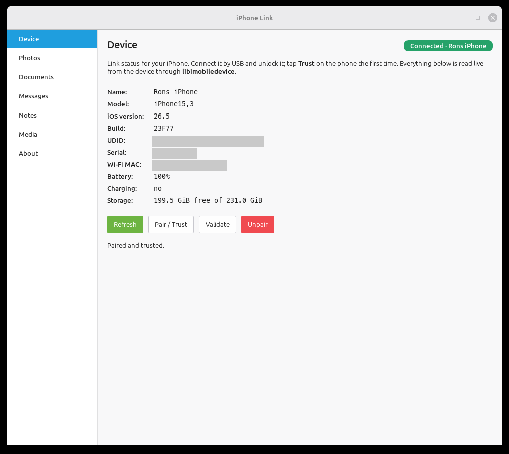
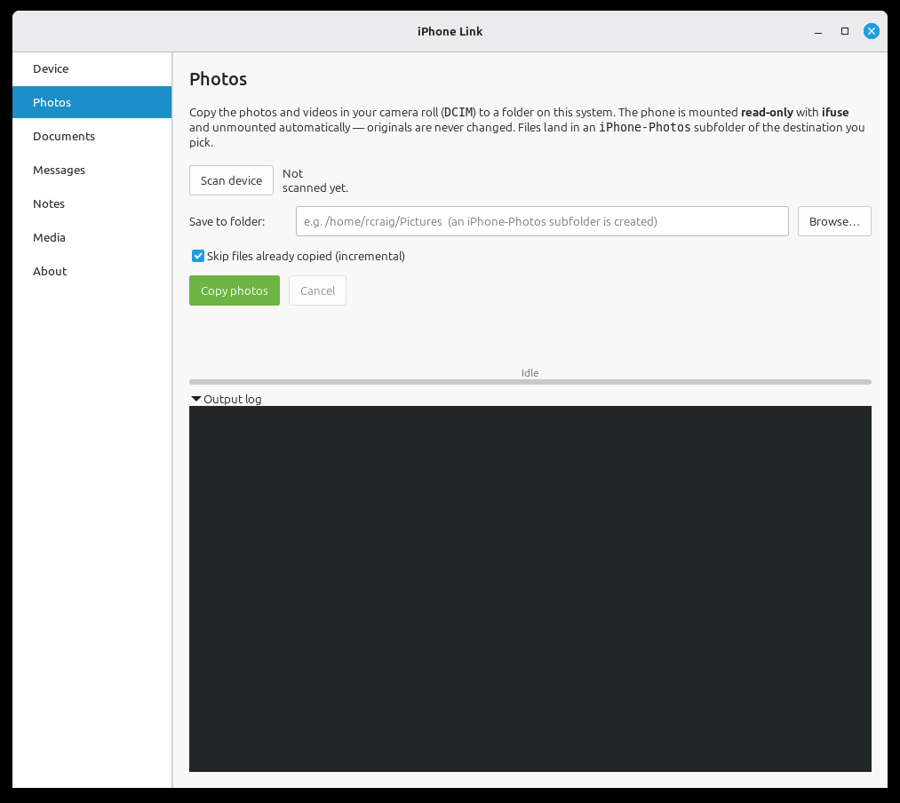
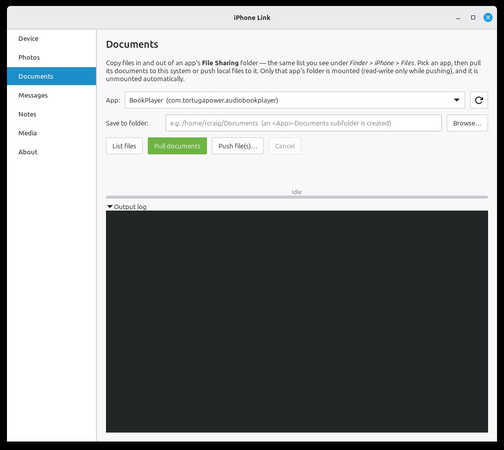
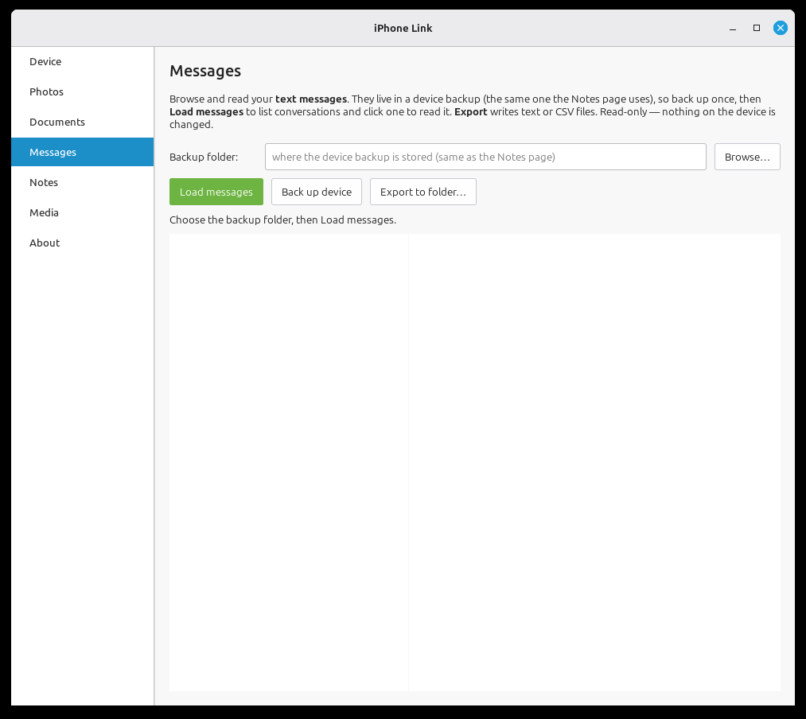
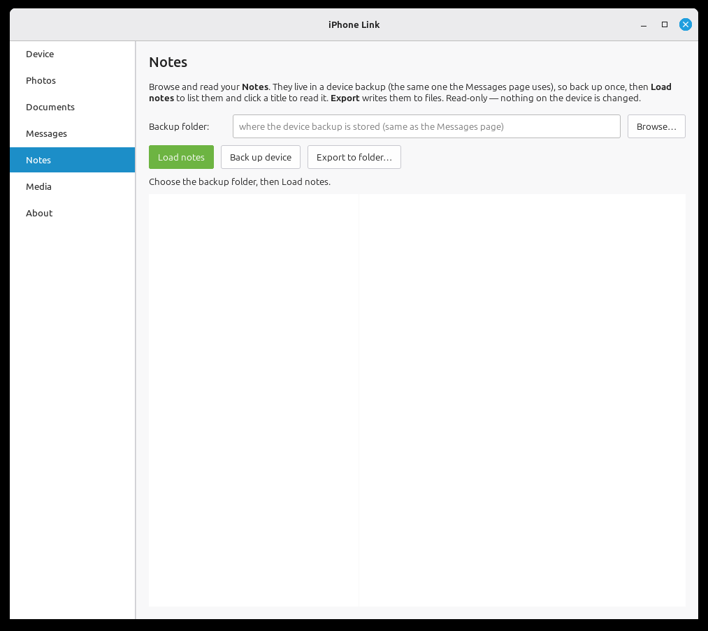
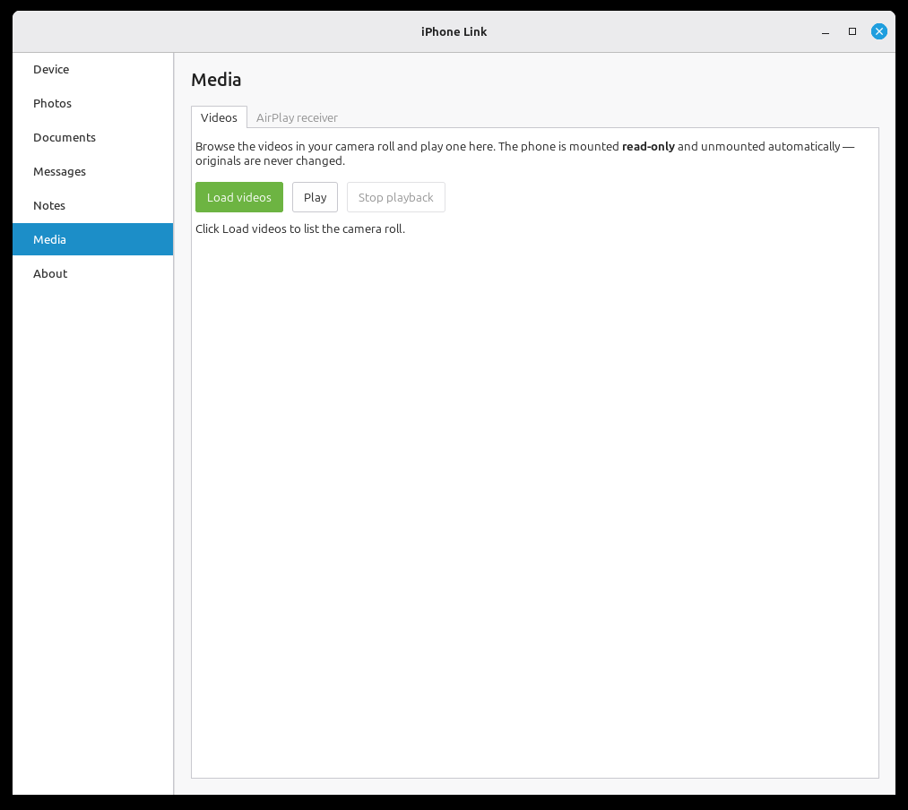
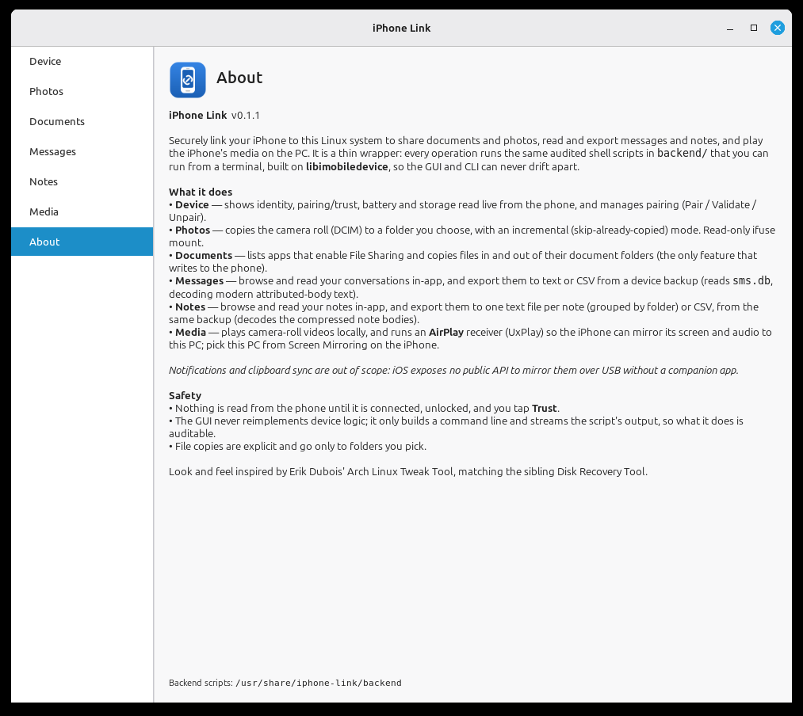

# iPhone Link

Securely link an iPhone to a Linux system to **share documents and photos**,
**read and export messages and notes**, and **play the iPhone's media on the PC**
— with a GTK4 interface styled after Erik Dubois' Arch Linux Tweak Tool (and the
sibling [Disk Recovery Tool](../disk-recovery-tool)).

It is built on [libimobiledevice](https://libimobiledevice.org),
[ifuse](https://github.com/libimobiledevice/ifuse) and
[UxPlay](https://github.com/FDH2/UxPlay). The GUI is a **thin wrapper**: every
operation runs an audited shell script in [`backend/`](backend) that you can run
from a terminal, so the GUI and CLI never drift apart. Nothing is read from the
phone until it is connected, unlocked, and you tap **Trust**.

> **Read-only by default.** Browsing, reading and exporting never modify the
> device. The only writes to the phone are the explicit *Push file(s)* action on
> the Documents page.

---

## Screenshots

A page per task in the sidebar. (Device identifiers below are redacted.)

| | |
|---|---|
| **Device** — identity, pairing/trust, battery & storage, live from the phone | **Photos** — copy the camera roll to a folder, incremental |
|  |  |
| **Documents** — copy files in and out of an app's File Sharing folder | **Messages** — browse, read and export your conversations |
|  |  |
| **Notes** — browse, read and export your notes | **Media** — play camera-roll videos, or run the AirPlay receiver |
|  |  |
| **About** — version, what each page does, where the scripts live | |
|  | |

---

## Features

The app is a sidebar of pages, each backed by one script in `backend/`:

- **Device** — identity, pairing/trust, battery and storage read live from the
  phone; manage pairing (Pair / Validate / Unpair).  → `device-info.sh`, `pair.sh`
- **Photos** — copy the camera roll (`DCIM`) to a folder, with incremental
  (skip-already-copied) mode. Read-only ifuse mount.  → `photos.sh`
- **Documents** — list apps that enable **File Sharing** and copy files **in and
  out** of an app's documents folder (the only feature that writes to the phone).
  → `documents.sh`
- **Messages** — **browse and read** your conversations in-app (list ↔ transcript),
  and **export** them to per-conversation text or a single CSV. Reads `sms.db`
  from an unencrypted backup, decoding the modern `attributedBody` message text.
  → `messages.sh`, `messages_export.py`
- **Notes** — **browse and read** your notes in-app (folders/titles ↔ body), and
  **export** them to one text file per note or CSV. Decodes the compressed
  protobuf note bodies in `NoteStore.sqlite`.  → `notes.sh`, `notes_export.py`
- **Media** —
  - *Videos*: browse the camera-roll videos and **play one locally** (`gst-play-1.0`).
  - *AirPlay receiver*: run **UxPlay** so the iPhone can mirror its **screen and
    audio to this PC** (Control Center → Screen Mirroring).
  → `media.sh`
- **About** — version, what each page does, and where the backend scripts live.

### Out of scope

**Notification mirroring** and **clipboard sync** are not included: iOS exposes
no public API to mirror them to a USB host without a companion iOS app.
---

## How messages & notes work (and why a backup)

iOS only exposes messages and notes **inside a device backup** (they are not
reachable over AFC/ifuse like photos are). So those pages:

1. **Back up** the device once with `idevicebackup2` (the first backup is full —
   several GB and slow; later ones are incremental). The same backup folder
   serves both Messages and Notes.
2. **Read** `sms.db` / `NoteStore.sqlite` out of that backup, **read-only**.

Only **unencrypted** backups are supported (`WillEncrypt = false`). If you have
"Encrypt local backup" turned on, the pages say so and stop — turn it off to
export. Parsing is done with Python's standard-library `sqlite3`; no extra tools.

---

## Requirements

- A graphical session (X11 or Wayland) and Python 3 with **GTK 4** + **PyGObject**.
- **libimobiledevice** (`ideviceinfo`, `idevicepair`, `idevicebackup2`, …),
  **usbmuxd**, **ifuse** (+ FUSE), and **avahi** (mDNS, for AirPlay discovery).
- **GStreamer** (`gst-play-1.0`) for local video playback.
- **UxPlay** *(optional)* for the AirPlay receiver. If your distro doesn't package
  it, everything else still works; install it from the AUR / a COPR / source.

`iphone-link` runs as **your user** (not root) — device access goes through your
per-user usbmuxd socket.

---

## Install

```sh
sudo ./install.sh          # arch (pacman) · debian (apt) · fedora (dnf)
```

The installer detects your distro, installs the dependencies, and copies the app
to `/usr/share/iphone-link` with a launcher at `/usr/bin/iphone-link`, a desktop
entry and an icon. UxPlay is attempted but treated as optional.

Run it:

```sh
iphone-link                # or launch "iPhone Link" from your app menu
```

> Do **not** run it with `sudo` — a root process can't reach your pairing records
> or session cleanly. Connect the iPhone by USB, unlock it, and tap **Trust** the
> first time.

### Run from the source tree (no install)

```sh
./iphone-gui/bin/iphone-link
```

The launcher finds the app and `backend/` relative to itself, so it works
straight from a checkout.

### Uninstall

```sh
sudo ./uninstall.sh        # leaves dependency packages and your backups in place
```

---

## Layout

```
iPhone_utility/
├── backend/                 audited shell + python scripts (the source of truth)
│   ├── _common.sh           shared helpers (udid resolution, steps, errors)
│   ├── device-info.sh  pair.sh
│   ├── photos.sh  documents.sh
│   ├── messages.sh  messages_export.py
│   ├── notes.sh     notes_export.py
│   └── media.sh
├── iphone-gui/
│   ├── bin/iphone-link       launcher
│   ├── src/                  GTK4 app (one *_page.py per sidebar page)
│   └── data/                 desktop entry + icon
├── install.sh  uninstall.sh
├── LICENSE  NOTICE  README.md
```

The GUI never reimplements device logic: each page builds a command line for a
`backend/` script and streams its output (see `iphone-gui/src/runner.py`). You can
run any script yourself, e.g.:

```sh
backend/device-info.sh
backend/photos.sh list
backend/messages.sh check
IDEVICE_UDID=<udid> backend/notes.sh view ~/iPhone-Backup
```

---

## Privacy & safety

- Read-only on the device except the explicit Documents *Push* action.
- Messages/notes viewing reads data into memory and renders it; **export** is the
  only path that writes that content to disk, to a folder you pick.
- Device backups are large and contain personal data — keep them somewhere safe.
  `idevicebackup2_folder/` is in `.gitignore` so a backup is never committed.

---

## License

GPL-3.0-or-later. See [LICENSE](LICENSE) and [NOTICE](NOTICE) (third-party
credits). iPhone Link consulted iDescriptor only as a design reference and copies
no AGPL code, so it remains GPL-3.0.
